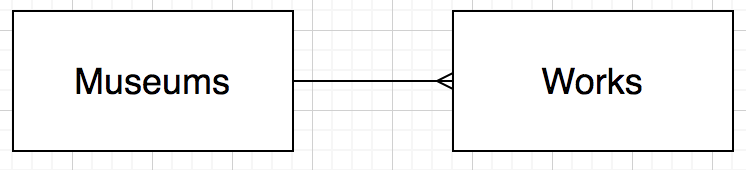

# Full Stack One to Many

## Learning Objectives

- Be able to implement CRUD repository methods for a one-to-many
- Be able to implement the ReSTful routes for a one-to-many


You have a list of `Work`s of art and a list of `Museum`s. Each work of art can only be in one `Museum` at a time, but each `Museum` can have many `Work`s of art.



There is a start point so that you can focus on the models, SQL and routes.

## Set Up

Re-name the start_point to `museums_works`

```bash
# terminal

mv start_point museums_works
cd museums_works
```

Create a database and run the SQL script

```bash
# terminal

createdb museums_works
psql -d museums_works -f db/museums_works.sql
```

Run the app:

```bash
# terminal

flask run
```

## MVP

Use the following user needs to complete the application:

- As a user, I want to view a list of all museums
- As a user, I want to add a new museum
- As a user, I want to view a list of all art works and the museum to which they belong
- As a user, I want to add a new work of art, including the museum to which it belongs


## Extensions

- As a user, I want to view, edit and delete a particular museum
- As a user, I want to view, edit and delete a particular work of art
- Add CSS to improve the user interface